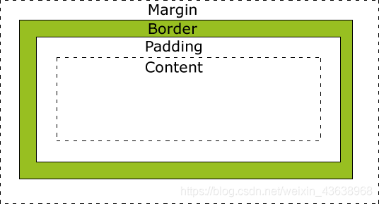
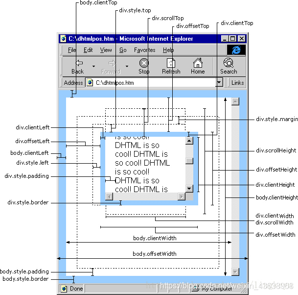

# 1. 盒模型

## 1. 什么是盒子模型

在我们HTML页面中，每一个元素都可以被看作一个盒子，而这个盒子由：内容区（content）、填充区（padding）、边框区（border）、外边界区（margin）四部分组成。

## 2. 盒子模型有哪两种

**标准模式下:** 一个块的总宽度(页面中占的宽度)= width + margin(左右) + padding(左右) + border(左右)

**怪异模式下：** 一个块的总宽度= width + margin(左右)（即width已经包含了padding和border值）（IE浏览器）

## 3. 标准和怪异模型的转换

box-sizing:content-box; 将采用标准模式的盒子模型标准。
box-sizing:border-box; 将采用怪异模式的盒子模型标准。
box-sizing:inherit; 规定应从父元素继承 box-sizing 属性的值。

[案例](boxsizing.html)。

## 4. JS盒模型

offsetWidth    //返回元素的宽度（包括元素宽度、内边距和边框，不包括外边距）

offsetHeight    //返回元素的高度（包括元素高度、内边距和边框，不包括外边距）

clientWidth     //返回元素的宽度（包括元素宽度、内边距，不包括边框和外边距）

clientHeight    //返回元素的高度（包括元素高度、内边距，不包括边框和外边距）

style.width     //返回元素的宽度（包括元素宽度，不包括内边距、边框和外边距）

style.height    //返回元素的高度（包括元素高度，不包括内边距、边框和外边距）

scrollWidth    //返回元素的宽度（包括元素宽度、内边距和溢出尺寸，不包括边框和外边距），无溢出的情况，与clientWidth相同

scrollHeigh    //返回元素的高度（包括元素高度、内边距和溢出尺寸，不包括边框和外边距），无溢出的情况，与clientHeight相同

1. style.width 返回的是字符串，如28px，offsetWidth返回的是数值28。

2. style.width/style.height与scrollWidth/scrollHeight是可读写的属性，clientWidth/clientHeight与offsetWidth/offsetHeight是只读属性。

3. style.width的值需要事先定义，否则取到的值为空。而且必须要定义在html里(内联样式)，如果定义在css里，style.height的值仍然为空，但元素偏移有效；而offsetWidth则仍能取到。

offsetTop  //返回元素的上外缘距离最近采用定位父元素内壁的距离，如果父元素中没有采用定位的，则是获取上外边缘距离文档内壁的距离。所谓的定位就是position属性值为relative、absolute或者fixed。返回值是一个整数，单位是像素。此属性是只读的。

offsetLeft    //此属性和offsetTop的原理是一样的，只不过方位不同。

scrollLeft    //此属性可以获取或者设置对象的最左边到对象在当前窗口显示的范围内的左边的距离，也就是元素被滚动条向左拉动的距离。返回值是一个整数，单位是像素。此属性是可读写的。

scrollTop  //此属性可以获取或者设置对象的最顶部到对象在当前窗口显示的范围内的顶边的距离，也就是元素滚动条被向下拉动的距离。返回值是一个整数，单位是像素。此属性是可读写的。

clientTop 	// 一个元素顶部边框的宽度（以像素表示） 。

clientLeft	// 一个元素左边框的宽度（以像素表示） 。

[案例](boxmodel.html)。

# 2. BFC

## 2.1 什么是BFC

+ BFC(Block formatting context)直译为"块级格式化上下文"。它是一个独立的渲染区域，只有Block-level box参与， 它规定了内部的Block-level Box如何布局，并且与这个区域外部毫不相干。
+ 具有 BFC 特性的元素可以看作是隔离了的独立容器，容器里面的元素不会在布局上影响到外面的元素，并且 BFC 具有普通容器所没有的一些特性。
+ Formatting context 是 W3C CSS2.1 规范中的一个概念。它是页面中的一块渲染区域，并且有一套渲染规则，它决定了其子元素将如何定位，以及和其他元素的关系和相互作用。最常见的 Formatting context 有 Block fomatting context (简称BFC)和 Inline formatting context (简称IFC)。 

## 2.2 BFC的布局规则

- 内部的Box会在垂直方向，一个接一个地放置。
- Box垂直方向的距离由margin决定。属于**同一个**BFC的两个相邻Box的margin会发生重叠。
- 每个盒子（块盒与行盒）的margin box的左边，与包含块border box的左边相接触(对于从左往右的格式化，否则相反)。即使存在浮动也是如此。
- BFC的区域不会与float box重叠。
- BFC就是页面上的一个隔离的独立容器，容器里面的子元素不会影响到外面的元素。反之也如此。
- 计算BFC的高度时，浮动元素也参与计算。

## 2.3 如何创建BFC

- overflow: auto/ hidden/scroll ;
- position: absolute/fixed;
- float: left/ right;
- display: inline-block/ table-cell/ table-caption/ flex/ inline-flex;

## 2.4 案例

[案例](bfc.html)。

# 3. 清除浮动

## 3.1 为什么要清除浮动

清除浮动主要是为了解决父元素因为子级元素浮动引起的内部高度为0的问题。

[案例](float.html)。

## 3.2 额外标签法

给谁清除浮动，就在其后额外添加一个空白标签（**不推荐使用**）。 
**优点：** 通俗易懂，书写方便。
**缺点：** 添加许多无意义的标签，结构化比较差。 

## 3.3 父级添加overflow方法

以通过触发BFC的方式，实现清除浮动效果。必须定义width或zoom:1，同时不能定义height，使用overflow:hidden时，浏览器会自动检查浮动区域的高度（**不推荐使用**）。
**优点：** 简单、代码少、浏览器支持好。
**缺点：** 内容增多时候容易造成不会自动换行导致内容被隐藏掉，无法显示需要溢出的元素。不能和position配合使用，因为超出的尺寸的会被隐藏。

## 3.4 使用after伪元素清除浮动

`:after`方式为空元素的升级版，好处是不用单独加标签了。IE8以上和非IE浏览器才支持:after，zoom可解决ie6,ie7浮动问题（**较常用推荐**）。

**优点：** 符合闭合浮动思想，结构语义化正确，不容易出现怪问题（目前大型网站都有使用，如：腾迅，网易，新浪等等）。

**缺点：** 由于IE6-7不支持`：after`，使用`zoom：1`。

## 3.5 使用before和after双伪元素清除浮动

**优点：** 代码更简洁（**较常用推荐**）。